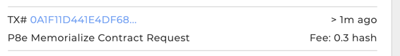
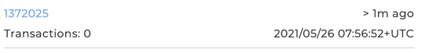
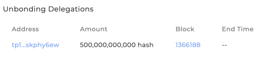
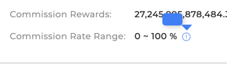
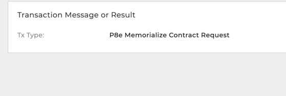
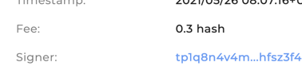
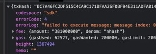
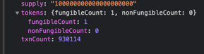
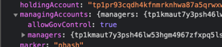

## Bugs:
### Dashboard
* Tx list shows very truncated fee
  
* Are timestamps in 24Hr or AM/PM?
  

### Validators
#### Single
* Unbonding time should be set
  
* Commission Rate Range popup should show Max Rate Change
  

### Transactions
#### General
* Anywhere txs are shown, there should be a monikers list in the response. These should replace
  addresses where appropriate.
#### Single
* Tx msgs should be shown in full

* Fee is shown extremely truncated

* We should be showing why a tx failed. The reason is in the response

  
### Assets
* When searching for an asset, the url goes to `https://explorer.test.provenance.io/assets/nhash` (notices assets, not asset)
#### Listview
#### Single
* We should be showing the token counts (fungible/nonfungible). It is available in the response
  
* For managing acocunts, we should also note if the marker can be controlled by governance. This is available
  in the response
  
  

## Changes
### General
* nhash conversions are no longer taking place. There is a metadata API that can be used to fetch for all 
  or one denom.
  
### Assets
#### Listview
* Added marker type to response. Might be nice to show that instead of status, as all listed are active.
#### Single
* Changed APIs
  * `/assets/{id}/detail` to `/assets/detail/{id}`, `/assets/detail/ibc/{id}` 
    -> as used by FE, these should resolve naturally
  * `/assets/{id}/holders` to `/assets/holders?id={denom}`
  * `/assets/{id}/metadata` -> `/assets/metadata?id={denom}` with `id` optional, returning full list of metadata
  
### Accounts
#### Single
* Moved balances out of the detail response to a paginated API
  * `/accounts/{address}/balances`
  
## New
### NFT Changes

ACCOUNTS:
* List Scopes where account == value owner or owner (getOwnership())

SCOPE LISTVIEW: ##DONE
* scopeaddr
* spec name or scope spec addr
* Last updated from tx

SCOPE DETAIL: ##DONE
* scope addr
* spec addr -> link to spec page/popup, whatever -> spec name links to address
* description (from spec)
* owner list w/roles
* value owner

SCOPE SUBLISTS: ##DONE
* Records ##DONE
  * Detail: record name
    * From Spec: record spec addr
    * Last Modified: Date (from session) From session addr -> link to session page/popup, whatever
    * record addr
    * parties that updated w/roles
  * NOTE: will need to show unfilled records
* Txs ##DONE
  * same tx list as always. filtered on txs connected to this scope addr

### IBC Changes
* Added an API for IBC Denom listview
* More to come
