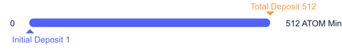
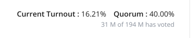
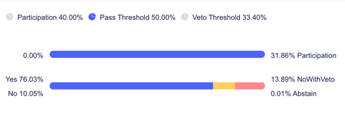

# Governance Proposals

This document is a work in progress. (Always)

- [Governance Proposals](#governance-proposals)
    * [Data changes](#data-changes)
    * [Ingestion](#ingestion)
    * [Listview](#listview)
    * [Proposal Detail](#proposal-detail)
        + [Header Detail](#header-detail)
        + [Votes Detail](#votes-detail)
        + [Deposit Detail](#deposit-detail)
    * [Validator Detail Changes](#validator-detail-changes)
        + [Voted Proposals Detail](#voted-proposals-detail)
        + [Gov Txs Detail](#gov-txs-detail)

Governance proposals are used to modify how the chain works. In order for a proposal to pass, 
it needs buy-in from validators and delegators alike. To make it easier for voters to see a proposal's
detail and status, we should add the following:

* a listview showing all proposals with
  * id
  * title
  * status
  * submit time
  * deposit end time
  * voting end time
* a proposal detail page
  * ref: https://www.mintscan.io/cosmos/proposals/46
  * ref: https://cosmoshub.iobscan.io/#/ProposalsDetail/47
  * typical detail info from query
  * list of voters
    * like the look of mintscan voter set up -> would return all voters, FE sorts
  * list of deposits
* modifications to validator detail page:
  * list of governance transactions associated with the operator address on the validator
  * list of votes made by the operator account
  * ref: https://cosmoshub.iobscan.io/#/staking/cosmosvaloper1fghgwhgtxtcshj4a9alp7u2qv6n2wffqhpxcnk
* pull params
  * `/cosmos/gov/v1beta1/params`
* pulling monikers from account addresses that belong to a validator
* existing API allows for showing all GOV txs
    
## Data changes
Will need some data changes to parse out proposal info
* gov_proposal &#9989;
* gov_vote &#9989;
* gov_deposit &#9989;

## Ingestion
Per tx:
* Record tx_messages &#9989;
* If successful
  * Record proposal &#9989;
  * Record vote w/tx info &#9989;
  * Record deposit w/tx info &#9989;

## Listview
Data from &#9989;
* `/cosmos/gov/v1beta1/proposals`
* ~~Will need to pull all proposals to reverse the order~~
* Coming from DB, can be paginated, already reversed
* ~~Return all records, let FE paginate through the list~~

Columns &#9989;
* id
* title
* status
* deposit percentage -> can show bar graph of current out of needed
  * initial, current, needed, and denom in obj
* submit time
* deposit end time
* voting end time

## Proposal Detail
### Header Detail
Proposal detail data from &#9989;
* `/cosmos/gov/v1beta1/proposals/{proposal_id}`
* Probably will pull from db, as that will be updated
* ref: https://www.mintscan.io/cosmos/proposals/47

Header Detail: &#9989;
* Proposal ID
* Title
* Status
* Proposer -> sent with moniker
* Type
* Description
* Details -> Dependent on the type of proposal
  
Timing Detail: &#9989;
* Deposit bar -> shows initial, current, min viable deposit amount
  
    
* Submit time
* Deposit End time
* Voting start time
* Voting End time -> maybe a bar to show how much time is left in period?

### Votes Detail
Votes Detail data from &#9989;
* `/cosmos/gov/v1beta1/proposals/{proposal_id}/votes`
* `/cosmos/gov/v1beta1/proposals/{proposal_id}/tally`
* Probably will pull from db, as that will be updated
* ref: https://www.mintscan.io/cosmos/proposals/47
  
  
* not a huge fan of this, but this does explain it okay

  
* Return all votes, let FE divvy up/paginate through the list

Votes Detail: &#9989;
* Tally details from tally query
* Votes from DB
  * Voter -> moniker if applicable
  * Tx Hash
  * Answer
  * Block height
  * Timestamp
    
### Deposit Detail
Deposit Detail data from &#9989;
* `/cosmos/gov/v1beta1/proposals/{proposal_id}/deposits`
* Probably will pull from db, as that will be updated
* ref: https://www.mintscan.io/cosmos/proposals/47

Deposit Detail: &#9989;
* Deposits from DB
    * Depositor -> moniker if applicable
    * Deposit type (initial, deposit)
    * Amount
    * Tx Hash
    * Block height
    * Timestamp

## Validator Detail Changes
### Voted Proposals Detail
Voted Proposal Data from &#9989;
* db tables
  * gov_vote
* paginated for FE
* need to pass in the owner address into api

Voted Proposal Detail: &#9989;
* Proposal ID
* Proposal Title
* Proposal status
* Vote answer
* Tx Hash

### Gov Txs Detail
Gov Txs Data from &#9989;
* db tables
    * txs for GOV module, operator address
* paginated for FE
* ref: https://cosmoshub.iobscan.io/#/staking/cosmosvaloper1fghgwhgtxtcshj4a9alp7u2qv6n2wffqhpxcnk

Gov Txs Detail:
* same as the other tx responses, but different columns

